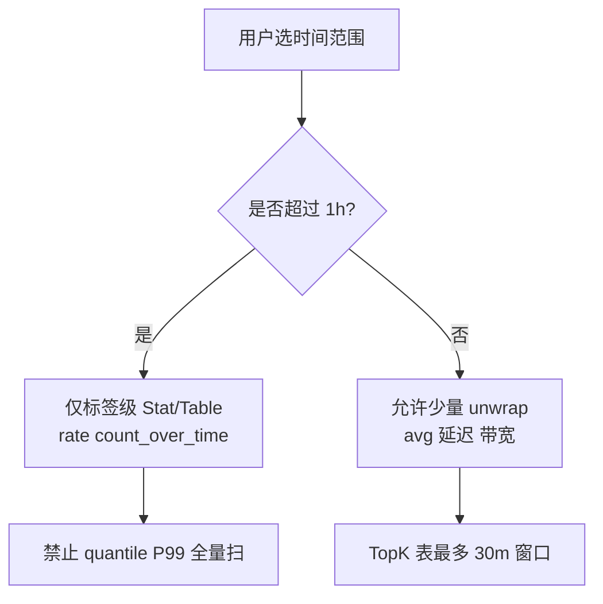
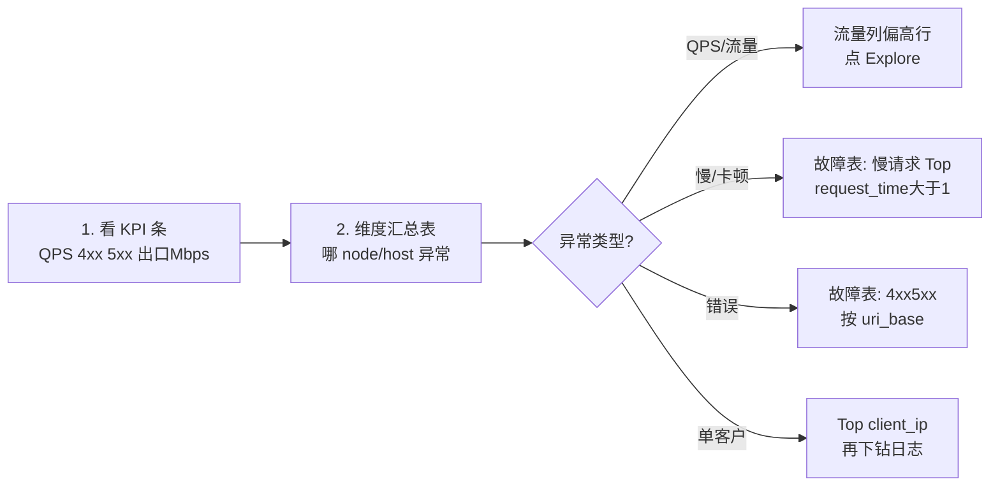
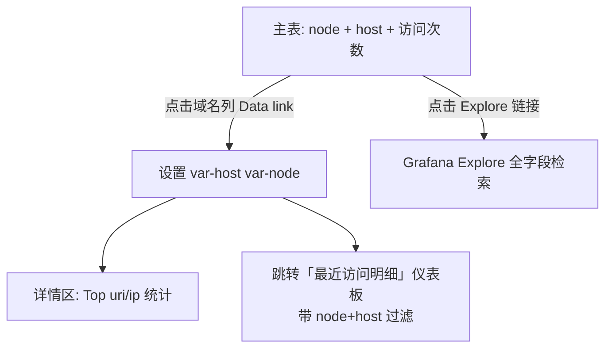

# Nginx Loki 运维报表方案（修订版）

## 您的场景与约束


| 运维问题       | 可从 Nginx 日志推断的维度                                          | 查询策略（单机 Loki）                                            |
| ---------- | --------------------------------------------------------- | -------------------------------------------------------- |
| 客户卡顿 / 系统慢 | `request_time`、`upstream_response_time`、`upstream_status` | **短窗口日志表** + 可选 15m 内 `avg`（避免 24h `quantile_over_time`） |
| 网络流量异常     | `bytes_sent`、`request_length`、`body_bytes_sent`           | 按 `node`/`host` 的 **rate + sum by 标签**（先过滤标签再 `          |
| 并发 / QPS 高 | 日志条数 rate                                                 | `sum(rate({...}[$__rate_interval]))`，按 `node`、`host` 分组  |
| 连接数高       | 见下文说明                                                     | **不能**直接用 JSON 字段 `connection`（那是连接 ID，不是并发连接数）          |


**生产日志字段对齐**（您提供的样例）：

- `node`：中转节点，如 `广州Nginx中转` → **Loki 标签 `node`**
- `host` / `server_name`：业务域名 → **Loki 标签 `host`**（与 `server_name` 二选一，值相同）
- `client_ip`：真实客户端 IP（已有）→ **留在日志体**，Top N 表仅查 **≤30m**
- `status` / `status_class`：日志内已有 `status_class` → **以标签 `status_class` 为准**（写入时以日志字段为准，Alloy 仅兜底）
- `uri` 含 `jsessionid` → Alloy 衍生 `**uri_base`**（去掉 `;jsessionid=...`）便于聚合，**不做标签**

**关于「连接数」**：样例中 `"connection":"2462134"` 是 Nginx 连接序号，**不等于** `worker_connections` 并发。若需真实连接数，应另采 `stub_status` 或 Prometheus `nginx_connections_active`；本方案用 **「活跃客户端 IP 数」** `count by (client_ip)`（15m，限量）作为辅助参考，并在 README 中说明局限。

---

## 设计原则（单机 Loki 性能红线）




1. **优先标签聚合**：`sum by (node, host)` + `rate` / `count_over_time`，不扫全文。
2. **unwrap 仅用于**：带宽（`bytes_sent`）、平均延迟（`request_time`），且必须带 `{node=~"$node", host=~"$host"}` 收窄。
3. **禁止或默认关闭**：24h 范围的 `quantile_over_time`、无标签过滤的 `topk(50)` on `uri`。
4. **仪表板数量**：**4 个**；**节点-域名挖掘** + **最近访问明细（全字段中文表）** 为日常最常用入口。
5. **默认时间**：`now-15m`～`now`，刷新 `1m`；**node×host 访问次数表**可用 `$__range`（纯标签查询，6h 内仍较快），详情区固定 **15m**。

---

## 排查流程（报表如何配合使用）




---

## 目标交付物（3 个仪表板）

Grafana Folder：`Nginx`，共享变量：


| 变量              | 来源                             | 说明                   |
| --------------- | ------------------------------ | -------------------- |
| `$node`         | `label_values(node)`           | 如 `广州Nginx中转`；支持 All |
| `$host`         | `label_values(host)`           | 业务域名；下钻时由链接自动填入      |
| `$method`       | `label_values(request_method)` | GET/POST             |
| `$status_class` | 多选 custom                      | 2xx/3xx/4xx/5xx      |


---

### 仪表板 1（核心）：`nginx-node-domains.json` — 按 Node 统计入口域名（数据挖掘 + 下钻）

**您要的能力**：选定中转节点 → 列出该节点承载的**入口域名（host）及访问次数** → 点击某域名查看明细。

#### 查询设计（快：双标签聚合，不扫 uri）

主表 LogQL（instant，`$__range` 为所选时间段总访问次数）：

```logql
sort_desc(
  sum by (node, host) (
    count_over_time({job="nginx", node=~"$node", host=~"$host"}[$__range])
  )
)
```

- `node`、`host` 均为 Loki **索引标签**，单机 Loki 下这是最快的「挖掘」聚合方式。
- 表列：**节点** | **入口域名** | **访问次数** | **占比%**（Transform：计算每 node 内 host 占比，或全表占比）
- 可选列（同表 Merge，5m 窗口）：**QPS** = `rate(...[5m])`、**4xx+5xx 次数**（标签过滤，无 json）

按 node 只看汇总（去掉 host 维度）的辅助表：

```logql
sort_desc(sum by (node) (count_over_time({job="nginx", node=~"$node"}[$__range])))
```

用于先选「哪个中转流量最大」，再在主表中看该 node 下有哪些域名。

#### 下钻交互（查看详情）




实现方式（参考已有 `[nginx-analytics.json](nginx-kafka-loki/server/grafana/dashboards/nginx-analytics.json)` 的 Data link 模式）：


| 交互          | 实现                                                                                     |
| ----------- | -------------------------------------------------------------------------------------- |
| 点击「入口域名」    | Data link 跳转本仪表板并带参：`var-node=${node}&var-host=${host}&var-drill=on`，自动展开下方 **详情 Row** |
| 点击「🔍 详情」   | 打开 Explore：`{job="nginx",node="$node",host="$host"}                                    |
| 详情 Row 显示条件 | 变量 `$drill` = on 或 `$host` 非 All 时展开（Grafana repeating / row 标题显示当前 node+host）         |


**详情区面板**（仅在选中 node+host 后查询，窗口 **15m**，避免拖慢）：


| 面板         | LogQL / 类型                                                                               |
| ---------- | ---------------------------------------------------------------------------------------- |
| Top URI    | Table：`topk(10, sum by (uri_base) (count_over_time({...} [15m])))`                       |
| Top 客户端 IP | Table：`topk(10, sum by (client_ip) (count_over_time({...} [15m])))`                      |
| 状态码分布      | Pie/Stat：`sum by (status_class) (count_over_time({...,node="$node",host="$host"}[15m]))` |
| 查看完整明细     | Data link → 仪表板 **「Nginx 最近访问明细」**，自动带上 `var-node`、`var-host`                            |


表头说明写入面板 description：**访问次数 = 时间段内日志条数**；与 QPS 关系为 `次数 ≈ QPS × 秒数`。

---

### 仪表板 2（新增）：`nginx-access-recent.json` — 最近访问明细（普通中文表格）

**用途**：像「数据表格」一样浏览最近 N 条 Nginx 访问记录，**最新一条在最上面**；表头全部中文；列覆盖当前生产 JSON 中的主要字段（与样例一致）。

#### 面板与查询

- **类型**：`Table`（非 Logs 流式面板），便于列宽、排序、导出 CSV
- **查询**：

```logql
{job="nginx", node=~"$node", host=~"$host", request_method=~"$method", status_class=~"$status_class"}
| json
```

- **行数**：Loki 数据源 `maxLines` = `${max_rows}`（变量 50 / 100 / 200 / 500，默认 100）
- **时间范围**：跟随仪表板时间选择器；**默认 `now-15m`**（README 注明：拉大到 6h 且 500 行可能变慢）
- **排序（最新在前）**：
  1. Loki 查询方向 `backward`（新→旧）
  2. Transform **Sort by**：字段 `请求时间`（`time_iso8601`）降序，确保表格顶部为最近访问

#### 字段提取与中文表头

查询后经 Grafana Transform 链：

1. **extractFields**（source=Line，format=json）— 从 JSON 日志解析各字段
2. **organize** — 按下列映射重命名、排列列顺序；隐藏原始 `Line`、`labels` 等
3. （可选）**filterFieldsByName** — 去掉空列


| JSON 字段                  | 中文表头            | 说明                    |
| ------------------------ | --------------- | --------------------- |
| `time_iso8601`           | 请求时间            | 主排序列                  |
| `node`                   | 中转节点            |                       |
| `host`                   | 请求域名            | 入口域名                  |
| `server_name`            | 服务名             | 常与 host 相同            |
| `uri_base`               | 接口路径            | Alloy 衍生，无 jsessionid |
| `uri`                    | 完整URI           |                       |
| `request_uri`            | 原始请求URI         |                       |
| `request_method`         | 请求方法            |                       |
| `status`                 | 状态码             |                       |
| `status_class`           | 状态分类            |                       |
| `client_ip`              | 客户端IP           |                       |
| `remote_addr`            | 远程地址            |                       |
| `remote_port`            | 远程端口            |                       |
| `request_time`           | 响应耗时(s)         |                       |
| `upstream_response_time` | 上游响应(s)         |                       |
| `upstream_connect_time`  | 上游连接(s)         |                       |
| `upstream_header_time`   | 上游首包(s)         |                       |
| `upstream_status`        | 上游状态码           |                       |
| `bytes_sent`             | 发送字节            |                       |
| `body_bytes_sent`        | 响应体字节           |                       |
| `request_length`         | 请求长度            |                       |
| `scheme`                 | 协议              | http/https            |
| `protocol`               | HTTP版本          |                       |
| `server_addr`            | 服务端IP           |                       |
| `server_port`            | 服务端口            |                       |
| `http_referer`           | 来源页             |                       |
| `http_user_agent`        | 用户代理            | 列宽加大或 tooltip         |
| `request_id`             | 请求ID            |                       |
| `http_x_request_id`      | 链路请求ID          |                       |
| `connection`             | 连接序号            | 非并发连接数                |
| `args`                   | 查询参数            |                       |
| `x_forwarded_for`        | X-Forwarded-For |                       |
| `x_real_ip`              | X-Real-IP       |                       |
| `ssl_protocol`           | SSL协议           |                       |
| `ssl_cipher`             | SSL加密套件         |                       |
| `ssl_server_name`        | SSL服务名          |                       |
| `message_key`            | 消息键             | 若有                    |
| `msec`                   | 毫秒时间戳           | 可选列，默认靠后              |


#### 表格 UX


| 项      | 设置                                                   |
| ------ | ---------------------------------------------------- |
| 默认列冻结  | 前 3 列：请求时间、中转节点、请求域名                                 |
| 列宽     | `请求时间` 180px、`接口路径` 260px、`用户代理` 300px（超出省略 + hover） |
| 行数控件   | 顶部 `$max_rows` 下拉，改后自动刷新                             |
| 与挖掘表联动 | 从 `nginx-node-domains` 点域名 → 跳转本表并锁定 `node`+`host`   |
| 性能提示   | 面板 description：行数×时间范围越大越慢；建议 15m + 100 行            |


#### 与「全列」的说明

- 以您提供的 **生产 JSON 样例字段为准**；若某节点日志缺少 SSL 等字段，对应列显示为空，不报错。
- 若后续 Nginx 日志新增字段，在 Alloy 不建标签的前提下仍会进入 JSON 体；可在 `organize` 中追加中文列名映射（README 维护字段对照表）。

---

### 仪表板 3：`nginx-ops-overview.json` — 运营总览（指标一表看清）

**Row A — KPI Stat（仅标签，瞬时/5m）**


| 面板      | LogQL 思路                                                                 |
| ------- | ------------------------------------------------------------------------ |
| 总 QPS   | `sum(rate({job="nginx",node=~"$node",host=~"$host"}[$__rate_interval]))` |
| 4xx 占比  | `sum(rate({...,status_class="4xx"}[5m])) / sum(rate({...}[5m]))`         |
| 5xx 占比  | 同上 `5xx`                                                                 |
| 出口 Mbps | `sum(rate({...}                                                          |
| 慢请求占比   | `sum(count_over_time({...}                                               |


**Row B — 核心：维度汇总大表（单 Table，多查询 + Merge）**

按 `**node` + `host`** 一行，列包括（均为 **instant** 或 **5m** 窗口）：


| 列名      | 查询 Ref | LogQL（示意）                                                                                             |
| ------- | ------ | ----------------------------------------------------------------------------------------------------- |
| 节点      | A      | `sum by (node, host) (count_over_time({job="nginx",...}[5m]))` → 仅作维度键                                |
| QPS     | B      | `sum by (node, host) (rate({...}[5m]))`                                                               |
| 4xx/s   | C      | `sum by (node, host) (rate({...,status_class="4xx"}[5m]))`                                            |
| 5xx/s   | D      | `sum by (node, host) (rate({...,status_class="5xx"}[5m]))`                                            |
| 出口 KB/s | E      | `sum by (node, host) (rate({...}                                                                      |
| 平均延迟 s  | F      | `sum by (node, host) (rate({...}                                                                      |
| POST 占比 | G      | `sum by (node, host) (rate({...,request_method="POST"}[5m])) / sum by (node, host) (rate({...}[5m]))` |


Grafana **Transform**：Merge by `node`+`host`，按 QPS 或 5xx/s 降序，一眼定位「哪个中转 + 哪个域名」异常。

可选第二张小表：**按 `node` 汇总**（去掉 host），用于看中转层整体负载，列同上但 `sum by (node)`。

---

### 仪表板 3：`nginx-troubleshoot.json` — 故障排查（两表 + 日志）

**表 1 — 慢请求 / 上游慢（卡顿、系统慢）**

- 数据源：Logs 或 Table，时间 **≤30m**
- LogQL：`{job="nginx",node=~"$node",host=~"$host"} | json | request_time > 0.5`（变量 `$slow_threshold` 默认 0.5）
- 展示列：`time`、`node`、`host`、`client_ip`、`request_method`、`uri_base`、`status`、`request_time`、`upstream_response_time`、`upstream_status`
- 排序：`request_time` desc，limit 100

**表 2 — 错误与热点（4xx/5xx、URI、IP）**

拆为 **两个 TopK 表**（同一 Row，左右各一，窗口固定 **15m**，避免 `$__range` 过大）：


| 表                  | LogQL                                                                 |
| ------------------ | --------------------------------------------------------------------- |
| Top 15 `client_ip` | `topk(15, sum by (client_ip) (count_over_time({...,status_class=~"4xx |
| Top 15 `uri_base`  | `topk(15, sum by (uri_base) (count_over_time({...,status_class=~"4xx  |


另：**错误日志流**（Logs 面板，50 行）：`{...,status_class=~"4xx|5xx"} | json | line_format "[{{.status}}] {{.request_method}} {{.uri_base}} ← {{.client_ip}} {{.request_time}}s {{.node}}"`

**表 3（可选，与表 1 同屏）— 流量突增域名**

`topk(10, sum by (host) (sum_over_time({...} | json | unwrap bytes_sent [15m]))` — 用于「流量异常」快速定位域名。

---

## 基础设施改动（不变，字段对齐生产）

### 1. 修复 Grafana 挂载

`[server/docker-compose.yml](server/docker-compose.yml)`：

```yaml
- ../grafana/provisioning:/etc/grafana/provisioning:ro
```

`[grafana/provisioning/datasources/loki.yml](grafana/provisioning/datasources/loki.yml)` 增加 `uid: loki`。

### 2. Alloy Consumer 标签（对齐您的 JSON）

修改 `[server/alloy/config-consumer.alloy](server/alloy/config-consumer.alloy)`：

**Loki 标签（低基数，查询快）**

```
job=nginx
node          ← JSON.node（广州Nginx中转）
host          ← JSON.host 或 server_name
request_method
status_class  ← 优先用日志内 status_class，缺失时再模板计算
scheme        ← http/https
```

**日志体内处理（不建标签）**

- `client_ip`：优先 `x_real_ip`，否则 `remote_addr`（与 Vector 逻辑一致）
- `uri_base`：从 `uri` 去掉 `;jsessionid=`*（regex stage）
- 数值字段保留：`request_time`、`bytes_sent`、`upstream_response_time` 等供 `| json | unwrap` 使用

**移除**：`status`（具体 200/404）作为 Loki 标签；旧变量 `env`、`app`、`os` 从仪表板中删除，统一为 `node`/`host`。

同步更新 `[client-linux/nginx-json-log-format.conf](client-linux/nginx-json-log-format.conf)` 注释，说明与生产字段 `client_ip`、`host` 一致。

### 3. 弃用旧仪表板

删除或归档 `[grafana/provisioning/dashboards/nginx-logs.json](grafana/provisioning/dashboards/nginx-logs.json)`（变量与字段均已过时）。

---

## 文件清单

```
grafana/
├── README.md                          # 排查流程 + 下钻说明 + 性能红线
└── provisioning/
    ├── datasources/loki.yml           # uid: loki
    └── dashboards/
        ├── dashboard.yml
        ├── nginx-node-domains.json    # ★ 按 node 统计入口域名/访问次数 + 下钻详情
        ├── nginx-ops-overview.json    # 运营 KPI + 指标汇总表
        └── nginx-troubleshoot.json    # 故障排查
server/
├── docker-compose.yml                 # 修复挂载
└── alloy/config-consumer.alloy        # 标签与 uri_base/client_ip
```

---

## 不在本次范围

- `quantile` P95/P99 长期趋势（单机 Loki 成本高；若必须要，仅 Explore 手动查且 ≤1h）
- 真实 Nginx 活跃连接数（需 stub_status / Prometheus）
- Grafana 告警规则（可二期从 `nginx-kafka-loki` 移植，阈值按 `$node` 分组）
- GeoIP / UA 解析

---

## 验证清单

1. **节点-域名表**：选 `node=广州Nginx中转`，可见 `host=sdjby.bg-online.com.cn` 及访问次数；与 Explore `count_over_time` 抽样一致
2. **下钻**：点击域名后，详情区出现该域名最新日志、Top URI/IP
3. Explore：`{job="nginx",node="广州Nginx中转",host="sdjby.bg-online.com.cn"} | json` 有数据
4. 运营总览：指标汇总表 **15m** 内 <10s；**6h** 时 node×host 次数表仍可用（纯标签）
5. 故障表：慢请求 `request_time > 1`、5xx Top `uri_base` 正常
6. 确认 `connection` 字段**未**被误用为并发指标

