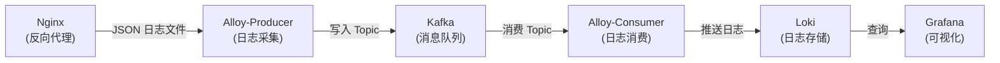

# Nginx 日志分析平台（单机 Docker 部署）

## 单机部署说明

所有服务跑在**同一台物理机/虚拟机**上，通过 Docker Compose 一键启停，共用同一 Docker 网络，无需多机或 K8s。

提供两种单机架构，按需求选择：


| 方案      | 架构                                             | 适用场景               | 单机资源参考            |
| ------- | ---------------------------------------------- | ------------------ | ----------------- |
| **简化版** | Nginx → Alloy → Loki → Grafana（无 Kafka）        | 日志量中等、希望省内存、部署最简单  | 约 2GB RAM，2 核 CPU |
| **完整版** | Nginx → Alloy → Kafka → Alloy → Loki → Grafana | 需要缓冲/解耦、后续可能接更多日志源 | 约 4GB RAM，2 核 CPU |


实施时二选一即可；默认实现**完整版**，若需简化版可去掉 Kafka 与 alloy-consumer，Alloy 直写 Loki。

## 整体架构（完整版，单机）




**单机简化版（无 Kafka）：**  
`Nginx → Alloy (file→loki.write) → Loki → Grafana`

## 项目目录结构

```
nginx-logs/
├── docker-compose.yml            # 主编排文件
├── .env                          # 环境变量 (端口、版本等)
├── nginx/
│   ├── nginx.conf                # Nginx 主配置 (JSON log_format)
│   ├── conf.d/
│   │   └── default.conf          # 反向代理站点配置
│   └── logs/                     # 日志挂载目录 (gitignore)
├── alloy/
│   ├── config-producer.alloy     # 采集端: 文件 -> Kafka
│   └── config-consumer.alloy     # 消费端: Kafka -> Loki
├── loki/
│   └── loki-config.yml           # Loki 配置
├── grafana/
│   ├── provisioning/
│   │   ├── datasources/
│   │   │   └── loki.yml          # 自动配置 Loki 数据源
│   │   └── dashboards/
│   │       ├── dashboard.yml     # 仪表板 provisioning 配置
│   │       └── nginx-logs.json   # 自定义 Nginx 日志分析仪表板
│   └── grafana.ini               # Grafana 配置 (可选)
└── README.md
```

## 各组件详细配置

### 1. Docker Compose 服务清单（单机，`docker-compose.yml`）

所有容器在同一主机、同一 compose 项目下启动，使用默认 bridge 或单自定义网络，无需跨机配置。

**完整版（含 Kafka）** — 共 7 个服务:

**数据层:** `kafka` (KRaft)、`loki` (单节点, 3100)

**采集层:** `alloy-producer`（读 Nginx 日志 → Kafka）、`alloy-consumer`（Kafka → Loki）

**应用层:** `nginx` (80/443)、`grafana` (3000)

**演示:** `httpbin`（Nginx 反向代理上游）

**单机资源建议（完整版）:** 内存约 4GB（Kafka ~1.5GB、Loki ~512MB、Grafana ~512MB、Alloy×2 各 ~256MB、Nginx/httpbin 少量），磁盘预留 20GB+ 给 Loki 数据与日志；可为各服务设置 `deploy.resources.limits` 防止单容器吃满。

**简化版（单机无 Kafka）:** 仅 5 个服务：`nginx`、`httpbin`、`alloy`（一个实例：file → loki.write）、`loki`、`grafana`；内存约 2GB 即可。

### 2. Nginx 配置 (`nginx/nginx.conf`)

关键点:

- 使用 `log_format json_analytics escape=json` 输出 JSON 结构化日志
- 日志字段包括: `remote_addr`, `time_iso8601`, `request`, `status`, `body_bytes_sent`, `http_referer`, `http_user_agent`, `request_time`, `upstream_response_time`, `request_id`
- `access_log /var/log/nginx/access.log json_analytics;`

```nginx
log_format json_analytics escape=json '{'
  '"remote_addr":"$remote_addr",'
  '"time_iso8601":"$time_iso8601",'
  '"request_method":"$request_method",'
  '"request_uri":"$request_uri",'
  '"status":$status,'
  '"body_bytes_sent":$body_bytes_sent,'
  '"http_referer":"$http_referer",'
  '"http_user_agent":"$http_user_agent",'
  '"request_time":$request_time,'
  '"upstream_response_time":"$upstream_response_time",'
  '"request_id":"$request_id"'
'}';
```

### 3. Alloy Producer 配置 (`alloy/config-producer.alloy`)

使用 Alloy 组件式语法:

- `local.file_match` - 发现 `/var/log/nginx/*.log` 文件
- `loki.source.file` - 读取日志文件
- `loki.process` - 使用 JSON stage 解析并提取 labels
- `loki.write` + Kafka 输出 — 将日志写入 Kafka topic

### 4. Alloy Consumer 配置 (`alloy/config-consumer.alloy`)

- `loki.source.kafka` - 从 Kafka broker 消费 topic `nginx-logs`
- `loki.process` - 处理标签 (status, method, uri 等)
- `loki.write` - 推送到 Loki (endpoint: `http://loki:3100/loki/api/v1/push`)

### 5. Loki 配置 (`loki/loki-config.yml`)（单机）

- 单节点模式 (`target: all`)
- `auth_enabled: false`
- 文件系统存储：chunks/rules 目录挂载到宿主机卷，便于备份与容量控制
- **单机必配**：设置 `retention_config` 或 `limits_config` 的 retention_period，避免磁盘被日志写满（例如保留 7 天）

### 6. Grafana 自定义仪表板 (`grafana/provisioning/dashboards/nginx-logs.json`)

仪表板面板包含:

- **总请求数** (stat panel) - 总 QPS 统计
- **状态码分布** (pie chart) - 2xx/3xx/4xx/5xx 占比
- **请求速率时序图** (time series) - 每秒请求数随时间变化
- **Top 10 请求路径** (table) - 按访问量排序
- **错误日志列表** (logs panel) - 4xx/5xx 错误详情
- **响应时间分布** (histogram) - P50/P95/P99 延迟
- **来源 IP Top 10** (bar gauge) - 访问量最大的 IP
- **实时日志流** (logs panel) - 原始日志查看

所有面板使用 LogQL 查询语言。

## 单机部署与调试步骤

### 一键启动（当前主机执行）

```bash
cd /path/to/nginx-logs
docker compose up -d
```

所有服务均通过 `localhost` 访问，无需改 IP。

### 验证步骤

1. 访问 `http://localhost:3000` 进入 Grafana (admin/admin)
2. 访问 `http://localhost` 触发 Nginx 日志
3. （完整版）访问 `http://localhost:12345` 查看 Alloy 组件状态
4. 在 Grafana Explore 用 LogQL: `{job="nginx"}`

### 调试方法

- `docker compose logs alloy-producer` - 检查采集状态
- `docker compose logs alloy-consumer` - 检查消费状态
- `docker compose exec kafka kafka-console-consumer.sh --bootstrap-server localhost:9092 --topic nginx-logs --from-beginning` - 直接查看 Kafka 消息
- Alloy UI (`localhost:12345`) 可查看 pipeline 各组件状态

## 技术选型说明


| 决策   | 选择            | 原因                                     |
| ---- | ------------- | -------------------------------------- |
| 日志采集 | Grafana Alloy | Promtail 已于 2026-03-02 EOL，Alloy 是官方替代 |
| 消息队列 | Kafka (KRaft) | 高吞吐量，无需 Zookeeper 简化部署                 |
| 日志格式 | JSON          | 免去正则解析，查询效率高                           |
| 日志存储 | Loki          | 只索引标签不索引内容，资源消耗低                       |


