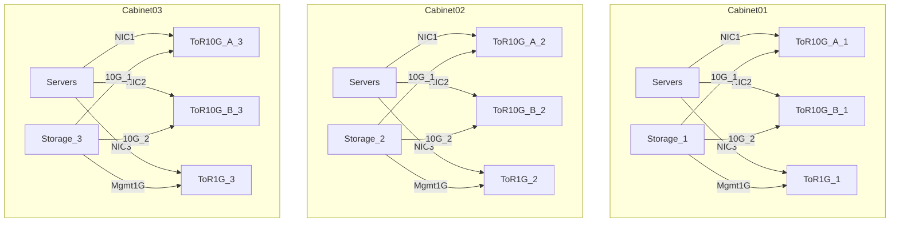

# 机房网络网关迁移改造文档

> **正式交付物**：请用浏览器打开同目录 **[机房网络网关迁移改造文档.html](机房网络网关迁移改造文档.html)**（含样式、目录导航、改造前/后对照、IP/VLAN/服务器/交换机/防火墙全表）。  
> 本 Markdown 为简要版；修改 HTML 源码见 `_html_source.md` 中 `html` 代码块。

---

## 总规划图（新增）

> 你刚才反馈“看不到总图”，这里已直接补到 Markdown（当前页可见）。

## 线缆分布与连接信息（新增）

### 3 机柜统一布线规则

- 服务器：`NIC1 -> ToR10G-A`、`NIC2 -> ToR10G-B`、`NIC3 -> ToR1G`
- 存储：`10G-1 -> ToR10G-A`、`10G-2 -> ToR10G-B`、`Mgmt1G -> ToR1G`
- 上联：`ToR10G-A/B -> 核心网络`，`ToR1G -> 管理网络`

### 机柜连接信息矩阵（模板）

| 机柜 | 设备类型 | 设备名称 | 本端端口 | 对端设备 | 对端端口 | 线缆 | 速率 | 用途 | 链路角色 | 启用状态 |
|---|---|---|---|---|---|---|---|---|---|---|
| Cabinet01 | Storage | Storage_1 | 10G-1 | ToR10G-A_1 | Eth1/0/47 | DAC/光纤 | 10G | 存储 | 主用 | 启用 |
| Cabinet01 | Storage | Storage_1 | 10G-2 | ToR10G-B_1 | Eth1/0/47 | DAC/光纤 | 10G | 存储 | 冗余 | 启用 |
| Cabinet01 | Storage | Storage_1 | Mgmt1G | ToR1G_1 | GE0/0/24 | Cat6 | 1G | 管理 | 管理 | 启用 |
| Cabinet02 | ToR10G-A | ToR10G-A_2 | Uplink1 | Core | Port-Channel | 光纤 | 10G | 业务 | 主用 | 启用 |
| Cabinet02 | ToR10G-B | ToR10G-B_2 | Uplink1 | Core | Port-Channel | 光纤 | 10G | 业务 | 冗余 | 启用 |
| Cabinet03 | ToR1G | ToR1G_3 | Uplink1 | Mgmt-Core | GE0/0/48 | Cat6/光纤 | 1G | 管理 | 管理 | 启用 |

### 服务器三网卡连接总表（节选）

| 机柜 | 服务器 | NIC1(10G-A) | NIC2(10G-B) | NIC3(1G) | IP/网关 | 状态 | 动作 |
|---|---|---|---|---|---|---|---|
| Cabinet01 | ws1 | ToR10G-A_1 | ToR10G-B_1 | ToR1G_1 | 公网IP + 10.0.0.11 | 启用/启用/启用 | 迁后释放NAT网卡 |
| Cabinet01 | ws2 | ToR10G-A_1 | ToR10G-B_1 | ToR1G_1 | 公网IP / 公网网关 | 启用/启用/启用 | 不改 |
| Cabinet02 | ws11 | ToR10G-A_2 | ToR10G-B_2 | ToR1G_2 | 10.0.0.14 / 10.0.0.11→10.0.0.254 | 启用/启用/启用 | 改网关 |
| Cabinet03 | ws19 | ToR10G-A_3 | ToR10G-B_3 | ToR1G_3 | 10.0.0.22 / 10.0.0.11→10.0.0.254 | 启用/启用/启用 | 改网关 |

## 文档说明

本文档涵盖：**服务器 ws1~ws20**、**内网交换机**、**华为 USG6305E 防火墙**、**线路 A/B**、**VLAN 192 / VLAN10**、**IP 地址分配**、**改造前/后对照**。

| 项目 | 值 |
|------|-----|
| 新网关 | **10.0.0.254**（GE0/0/7） |
| 旧网关 | 10.0.0.11（ws1，迁后释放） |
| B 组改动 | 仅改默认网关 |
| A 组 | ws1~ws8 公网 IP，**不改** |

---

## 1. 改造概述（改不改一览）

| 对象 | 改不改 | 说明 |
|------|--------|------|
| 线路 A / GE0/0/0 / GE0/0/1 | **不改** | 交换 VLAN1 透传 |
| 线路 B / XGE0/0/0 | **新增** | 光纤 + 路由 WAN |
| GE0/0/7 | **新增** | 10.0.0.254 网关 |
| 交换机 Sw-A / VLAN192 | **不改** | A 组端口 |
| 交换机 Sw-B | **新增** | Access VLAN10 |
| ws1~ws8 | **不改** | 公网 IP |
| ws9~ws20 | **改网关** | 10.0.0.11 → 10.0.0.254 |
| ws1 NAT | **稍后** | B 组迁完后关闭 |

---

## 2. 线路 A / 线路 B

| 对比项 | 线路 A（不动） | 线路 B（新增） |
|--------|----------------|----------------|
| 防火墙口 | GE0/0/0 | XGE0/0/0 光口 |
| 模式 | 交换 VLAN1 | 路由 WAN |
| 配对 | GE0/0/1 → Sw-A | GE0/0/7 → Sw-B |
| 防火墙 IP | 无 | WAN: `<线路B公网IP>` · LAN: **10.0.0.254** |
| 服务器 | ws1~ws8 | ws9~ws20 |
| NAT | 无 | SNAT 10.0.0.0/24 |

---

## 3. VLAN（改造前 → 改造后）

| VLAN | 网段 | 改造前网关 | 改造后网关 | 成员 |
|------|------|------------|------------|------|
| VLAN 1 | 无三层 | — | — | GE0/0/0 ↔ GE0/0/1 ↔ Sw-A |
| **VLAN 192** | 公网 IP | 各服务器公网网关 | **不变** | ws1~ws8 网卡1 |
| **VLAN10** | 10.0.0.0/24 | **10.0.0.11** (ws1) | **10.0.0.254** (防火墙) | ws9~ws20 + Sw-B |

---

## 4. 物理接线

### 改造前

| 本端 | 端口 | 对端 | 用途 |
|------|------|------|------|
| 运营商A | — | GE0/0/0 | 线路A |
| USG | GE0/0/1 | Sw-A | 透明桥 |
| 交换机 | Access | ws1~ws8 网卡1 | VLAN192 |
| 交换机 | Access | ws9~ws20 | VLAN10 |
| 交换机 | Access | ws1 网卡2 | 10.0.0.11 NAT |
| USG | XGE0/0/0 | **未接** | 空闲 |
| USG | GE0/0/7 | **未接** | 空闲 |

### 改造后

| 本端 | 端口 | 对端 | 变更 |
|------|------|------|------|
| 运营商A | — | GE0/0/0 | 不动 |
| USG | GE0/0/1 | Sw-A | 不动 |
| 运营商B | 光纤 | **XGE0/0/0** | **新增** |
| USG | **GE0/0/7** | **Sw-B** | **新增** |
| 各服务器网线 | — | — | 不动 |

---

## 5. 防火墙接口

| 接口 | 改造前 | 改造后 | IP | 变更 |
|------|--------|--------|-----|------|
| GE0/0/0 | 交换VLAN1 | 同左 | 无 | 否 |
| GE0/0/1 | 交换VLAN1 | 同左 | 无 | 否 |
| XGE0/0/0 | 空闲 | 路由WAN | `<线路B公网IP/掩码>` | **新增** |
| GE0/0/7 | 空闲 | 路由LAN | **10.0.0.254/24** | **新增** |

---

## 6. 交换机端口

| 端口 | 模式 | VLAN | 接入 | 变更 |
|------|------|------|------|------|
| Sw-A | Access/Trunk | VLAN1 | GE0/0/1 | 不动 |
| A组口 | Access | 192 | ws1~ws8 网卡1 | 不动 |
| B组口 | Access | VLAN10 | ws9~ws20 | 不动 |
| ws1网卡2口 | Access | VLAN10 | ws1 | 端口不动 |
| **Sw-B** | **Access** | **VLAN10** | **GE0/0/7** | **新增** |

---

## 7. 10.0.0.0/24 IP 分配

| IP | 设备 | 改造前 | 改造后 |
|----|------|--------|--------|
| **10.0.0.254** | USG GE0/0/7 | — | **B组新网关** |
| 10.0.0.11 | ws1 网卡2 | NAT网关 | 释放 |
| 10.0.0.12 | ws9 | 内网 | 网关→254 |
| 10.0.0.13 | ws10 | 内网 | 网关→254 |
| 10.0.0.14 | ws11 | 内网 | 网关→254 |
| 10.0.0.15 | ws12 | 内网 | 网关→254 |
| 10.0.0.16 | ws13 | 内网 | 网关→254 |
| 10.0.0.17 | ws14 | 内网 | 网关→254 |
| 10.0.0.18 | ws15 | 内网 | 网关→254 |
| 10.0.0.19 | ws16 | 内网 | 网关→254 |
| 10.0.0.20 | ws17 | 内网 | 网关→254 |
| 10.0.0.21 | ws18 | 内网 | 网关→254 |
| 10.0.0.22 | ws19 | 内网 | 网关→254 |
| 10.0.0.23 | ws20 | 内网 | 网关→254 |

> ws9~ws20 IP 为**示例**，请按现网修改。

---

## 8. 服务器清单 ws1~ws20

### A 组（VLAN192 · 公网 · 线路A · 不改）

| 主机 | 网卡 | IP | 掩码 | 网关 | 出网 |
|------|------|-----|------|------|------|
| ws1 | 网卡1 | `<公网IP-1>` | `<掩码>` | `<运营商网关>` | 线路A |
| ws1 | 网卡2 | 10.0.0.11 | /24 | — | NAT(迁后释放) |
| ws2 | 网卡1 | `<公网IP-2>` | `<掩码>` | `<运营商网关>` | 线路A |
| ws3 | 网卡1 | `<公网IP-3>` | ... | ... | 线路A |
| ws4 | 网卡1 | `<公网IP-4>` | ... | ... | 线路A |
| ws5 | 网卡1 | `<公网IP-5>` | ... | ... | 线路A |
| ws6 | 网卡1 | `<公网IP-6>` | ... | ... | 线路A |
| ws7 | 网卡1 | `<公网IP-7>` | ... | ... | 线路A |
| ws8 | 网卡1 | `<公网IP-8>` | ... | ... | 线路A |

### B 组（VLAN10 · 内网 · 线路B · 改网关）

| 主机 | IP | 改造前网关 | 改造后网关 | 操作 |
|------|-----|------------|------------|------|
| ws9 | 10.0.0.12 | 10.0.0.11 | **10.0.0.254** | 改GATEWAY |
| ws10 | 10.0.0.13 | 10.0.0.11 | **10.0.0.254** | 改GATEWAY |
| ws11 | 10.0.0.14 | 10.0.0.11 | **10.0.0.254** | 改GATEWAY |
| ws12 | 10.0.0.15 | 10.0.0.11 | **10.0.0.254** | 改GATEWAY |
| ws13 | 10.0.0.16 | 10.0.0.11 | **10.0.0.254** | 改GATEWAY |
| ws14 | 10.0.0.17 | 10.0.0.11 | **10.0.0.254** | 改GATEWAY |
| ws15 | 10.0.0.18 | 10.0.0.11 | **10.0.0.254** | 改GATEWAY |
| ws16 | 10.0.0.19 | 10.0.0.11 | **10.0.0.254** | 改GATEWAY |
| ws17 | 10.0.0.20 | 10.0.0.11 | **10.0.0.254** | 改GATEWAY |
| ws18 | 10.0.0.21 | 10.0.0.11 | **10.0.0.254** | 改GATEWAY |
| ws19 | 10.0.0.22 | 10.0.0.11 | **10.0.0.254** | 改GATEWAY |
| ws20 | 10.0.0.23 | 10.0.0.11 | **10.0.0.254** | 改GATEWAY |

---

## 9. 流量路径

**改造前**
- A组：`公网IP → VLAN192 → 透明桥 → 线路A`
- B组：`10.0.0.x → ws1(10.0.0.11) NAT → 公网IP → 线路A`

**改造后**
- A组：`公网IP → VLAN192 → 线路A`（不变）
- B组：`10.0.0.x → 10.0.0.254 → SNAT → 线路B`

---

## 10. 配置脚本（摘要）

见方案计划文件完整 Huawei 命令。核心：

- XGE0/0/0：路由模式 + 线路B公网IP
- GE0/0/7：`ip address 10.0.0.254 255.255.255.0`
- SNAT：10.0.0.0/24 → 线路B
- B组 Linux：`GATEWAY=10.0.0.254`

---

## 11. 割接步骤

1. 准备：导出 NAT、记录实际 IP、获取线路 B 参数  
2. 预配：接光纤/网线、预写配置  
3. 激活：启用 XGE/GE7、ping 10.0.0.254、验证 A 组  
4. 灰度：1~2 台 B 组改网关  
5. 批量：分 3~4 批切换  
6. 收尾：下线 ws1 NAT、更新本文档 IP  

---

## 12. 核对清单

- [ ] VLAN10 实际 VLAN ID  
- [ ] Sw-A / Sw-B 端口号  
- [ ] 10.0.0.254 未占用  
- [ ] 各台服务器实际 IP 填入第 8 节  
- [ ] 线路 B 公网 IP/掩码/网关  
- [ ] ws1 iptables 备份  
- [ ] 改网关脚本 + 回滚脚本  

---

**打开方式**：双击 `机房网络网关迁移改造文档.html`，或在资源管理器中拖入 Chrome / Edge。
